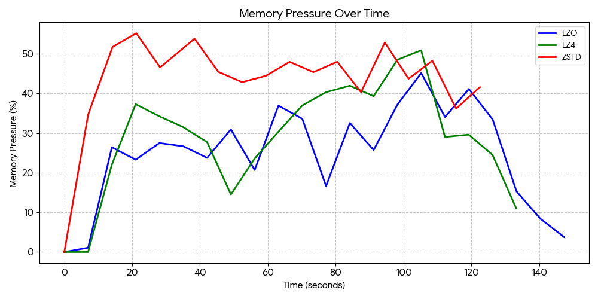
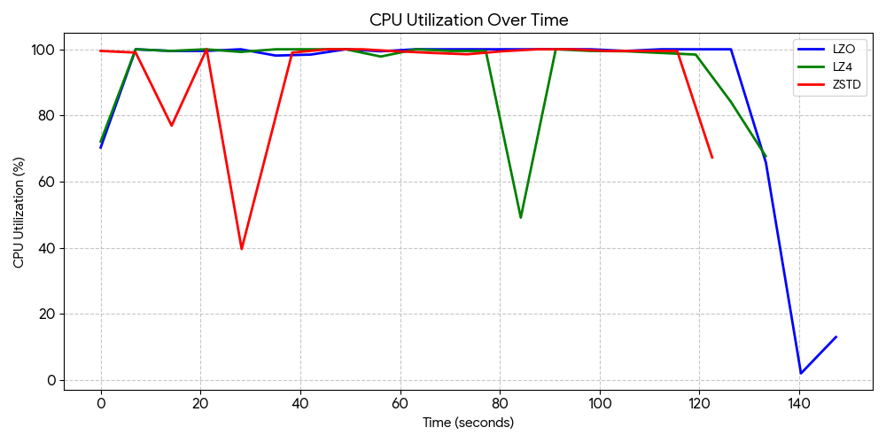
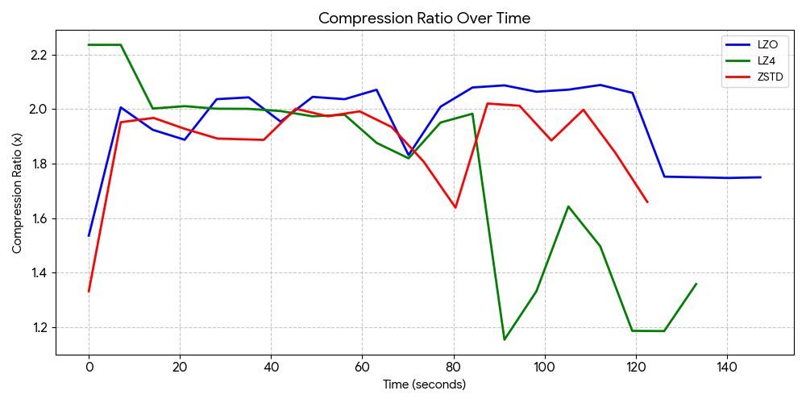

+++
title = "Memory Movement Avoidance"
[extra]
[[extra.authors]]
name = "Brian Castellon Rosales"
[[extra.authors]]
name = "Jared Ho"
[[extra.authors]]
name = "Samuel Shaaban"
+++

# Introduction

Modern computing systems frequently face tradeoffs between available memory capacity and CPU resources. When memory becomes scarce, operating systems often resort to swapping pages to disk, which can significantly degrade performance due to the high latency of disk I/O. As a result, reducing or delaying swap activity is an important goal for maintaining system performance under memory pressure.

One approach to improve this issue is compressed memory, where pages are compressed and stored in RAM rather than being immediately written to disk. Linux provides this capability through zswap, a compressed cache that stores swapped pages in memory before they reach disk. By compressing memory pages, zswap can effectively increase the usable memory capacity of the system and reduce the number of disk accesses.

The goal of our project was to explore whether compression settings could be adaptively adjusted based on system conditions to improve performance during periods of high memory pressure. In particular, we focused on the tradeoff between CPU utilization and level of compression. Compression can reduce memory usage and delay swapping, but it also consumes CPU resources. Determining how to balance these competing demands is a key systems design challenge.

We developed a controller that monitors system metrics such as CPU usage, memory pressure, and swap activity, and dynamically adjusts compression behavior in response to changing conditions. Through controlled experiments using synthetic memory workloads, we evaluated how compression affects system behavior and how effectively it can reduce swap activity while managing CPU overhead.
# Background
When a system experiences memory pressure, the OS may move memory pages to disk through a process called swapping. While swapping allows programs to continue running when RAM is exhausted, it introduces significant performance overhead because disk access is much slower than memory access. To improve this, modern OS employ techniques designed to reduce the amount of memory written to disk.

One such mechanism in Linux is zswap, a compressed cache that sits in front of the swap device. Instead of immediately writing pages to disk, zswap first compresses them and stores them in a compressed memory pool in RAM. If the compressed pool becomes full, only then are pages written to disk. By compressing pages in memory, zswap can effectively increase the usable capacity of RAM and reduce the frequency of disk swaps

However, compression introduces its own tradeoffs. Compressing and decompressing memory pages consumes CPU time, and different compression algorithms offer different balances between speed and compression effectiveness. Some algorithms such as ZSTD are optimized for decompression speed, making it helpful in uses that decompress significantly more often than they compress, which usually isn’t the case for swapped pages. Other algorithms instead provide a wide range of compression levels to allow tailoring it to many different scenarios.

The challenge is determining when and how aggressively compression should be applied. If compression starts too late, the system may still resort to disk swapping, which adds additional CPU load. If compression is too aggressive, it may use excess CPU resources that could be repurposed elsewhere while there is still unused memory available. Our project explores how system metrics such as CPU utilization and memory pressure can be used to guide compression decisions in order to reduce swap activity while maintaining efficient CPU usage.

# Design and Implementation

Our design was split into two main components: the dynamic controller and the workload generators.

## The Dynamic Controller

The core of our movement avoidance system is a monitoring controller that continuously collects data from Linux kernel interfaces. The controller reads Memory Pressure Stall Information (PSI) from /proc/pressure/memory to determine how often processes stall due to a lack of memory, measures CPU usage to prevent excessive compression overhead, and monitors /proc/vmstat to detect when pages are being swapped to disk.

Based on these metrics, the controller dynamically adjusts the zswap max_pool_percent bounds between 5% and 50%. Ideally, it should employ an adaptive algorithm selection based on hardware thresholds. When CPU usage is high (~70%), it switches to the faster LZO algorithm to lower computational load. When memory pressure is high and CPU resources are available, it can switch to ZSTD to maximize capacity. LZ4 can be used in a more balanced scenario. The controller is also designed with NUMA-awareness to monitor cross-node memory access rates and preemptively increase compression if NUMA miss rates start rising beyond a configured level.

## Workload Generation

To properly test the controller's policy, we developed several independent workload generators to isolate different system stressors.
* Memory Workload: We built a custom generator designed to rapidly allocate large memory blocks (in 10MB chunks) and continuously modify the data. This bypasses standard OS deduplication and forces genuine memory pressure. We also implemented a high-performance C-based allocator for strict cgroup limit testing.
* CPU Contention: To test how the controller handles compression when compute resources are constrained, we built a dedicated CPU workload generator. This script manages background Python multiprocessing workers to hold CPU contention at precise target percentages from 0% to 100%.
* Synthetic and Real Sweeps: We utilized stress-ng to automate synthetic test sweeps across different memory access patterns (random vs. sequential) while varying CPU contention. For real-world application validation, we implemented workload managers to map the Pareto frontier of capacity versus latency using Redis benchmarking and llama.cpp LLM inference tests.

# Evaluation
To evaluate our dynamic compression controller, we collected metrics including memory pressure, CPU utilization, swap activity, and zswap pool statistics. We designed synthetic workloads to consume memory and generate system contention. During static baseline testing of individual algorithms under heavy allocation pressure, LZO unexpectedly outperformed both LZ4 and ZSTD. LZO maintained the most consistent compression ratio while consuming the least CPU and keeping system memory pressure capped at a lower maximum. In contrast, ZSTD and LZ4 struggled with CPU overhead, which bottlenecked the system's ability to compress pages fast enough. A key finding during these evaluations was that memory allocation often happens in large chunks, making it difficult for the dynamic system to react in time, as the sudden allocations use a large amount of CPU.

## Testing Environment

**CPU**: Intel Core i5-1135G7
\
**RAM**: DDR4 3200MHz
\
**VMware Workstation Pro**: Configured with either 1 or 4 CPUs and 4 GB of memory
## Results
In a controlled workload stressing the memory by allowing the CPU to continuously compress memory, all three algorithms were compared with the following results.

### Compression Ratio
* LZO averaged 1.95x compression and remained incredibly stable throughout the entire run, consistently staying between 1.74x and 2.08x.
* LZ4 had the worst overall average at a 1.77x ratio. While it started at a high peak of 2.23x, the compression collapsed to lower levels as the system hit high memory pressure.
* ZSTD averaged at 1.87x compression ratio. This is unexpected as it should have a higher compression ratio compared to LZO, suggesting that it is taking too long to compress and decompress, leaving LZO as a better option.

### CPU Overhead

* LZO consumed the least amount of CPU utilization, averaging 88.4%.
* LZ4 and ZSTD both struggled with the CPU load, averaging at 93.1% and 93.2% load, respectively.

### Memory Pressure

* LZO was fast enough to compress the incoming data without bottlenecking the CPU, and had a maximum memory pressure value of 45.19%.
* LZ4 had a maximum of 50.93%.
* ZSTD had the highest maximum value of 55.23%.

# Challenges

A major challenge we encountered was that memory workloads often increase pressure suddenly, making dynamic compression control difficult. Because memory allocation frequently happens in large, abrupt chunks, the system struggles to react quickly enough, and the sudden allocations themselves consume significant CPU resources. Furthermore, once the system's memory fills up, it becomes extremely difficult to maintain compression because page swaps begin actively competing with the compression algorithms for CPU time.

Additionally, validating our NUMA-aware compression logic proved difficult during testing. The controller was designed to monitor cross-node access rates and adjust compression if the NUMA miss rate exceeded a 30% threshold. However, we realized after our testing that our environment had been consistently recording 0% NUMA miss rates across all tests. This occurred since we had not properly configured our virtual machine to enable virtual NUMA (vNUMA) with our CPU, causing our multi-threaded tests to fall back to a single-node default, leaving the NUMA-aware dynamic adjustments inactive.

# Future Work

There is the possibility of more useful data being produced by a workload of a fundamentally different kind. The workloads we tested, mainly were focussed on measuring CPU performance, and tend to provide more CPU load than memory load. Simply switching to an LLM workload could significantly help in shifting more of the computation time onto memory stalls rather than the CPU actually working. Additionally, a workload like an LLM would likely gain more of a performance boost from this than some more traditional, linear workloads, but this would require testing to confirm. Alternatively, we could write another custom workload that allocates and then touches memory without causing too much CPU stress.

There is also plenty of room for better performance metrics. A workload that either provides its own performance metrics, or performs a fixed amount of computations to permit runtime measurements would allow us to make more deterministic measurements. Currently we have CPU usage, swap activity, and memory pressure, but careful interpretation of these graphs is required to properly compare the performance of each. 

The results here also quite heavily depend on the hardware and VM setup. Particularly, the more memory the workload utilizes, the more CPU is required to properly manage compressing data into it. For this reason, different core count and memory allocations can produce vastly different results.

There is also the potential to utilize a similar system to ours, but instead with a precomputed, fixed compression policy. This would fix any issues related to the sudden ramp up of CPU and memory utilization as a stress test workload started.
# Conclusion

Through our project, we found that memory compression is a viable method of reducing swap usage and memory access latency. It does this by utilizing unused CPU time to keep compressed pages in the low latency DRAM rather than swapping to a slower disk. Through testing of various compression algorithms, we found LZO to have the best tradeoff between compression ratio and CPU utilization. We found that certain compression ratios like ZSTD are optimized for decompression speed, while we need both compression and decompression to be fast, making it not viable.

While static compression works well, we found it more difficult to produce a dynamic algorithm that can properly adapt to the sudden changes in CPU and memory utilization that most workloads produce. This leads us to believe that the ideal usage of a system like this would be through a static setup, with precomputed compression ratios dependent upon the workload.

# Extra Resources

1. [zswap kernel documentation](https://www.kernel.org/doc/html/latest/admin-guide/mm/zswap.html)
2. [Zstandard reference library](https://facebook.github.io/zstd/)
3. [LZO website](https://www.oberhumer.com/opensource/lzo/)
4. [LZ4 website](https://lz4.org/)
5. [cgroups(7) - Linux manual page](https://man7.org/linux/man-pages/man7/cgroups.7.html)
6. [TMO: Transparent Memory Offloading in Datacenters](https://www.cs.cmu.edu/~dskarlat/publications/tmo_asplos22.pdf)

# Contributions to Project
**Brian Castellon Rosales**: Formatting/writing slides and report, worked on visualize.py, controller.py, and allocate_memory.c
\
**Jared Ho**: Planning and designing the architecture, worked on controller.py and workload modules
\
**Samuel Shaaban**: Wrote allocate_memory.c in C and makefile, ran tests and modified scripts to remove errors

# AI Disclosure

Gemini-3-Pro, GLM-4.7, and Qwen3-Coder-Next were used for coding initial versions of the project. ChatGPT and Claude were used to quickly read through and aid in troubleshooting error logs for VM and cgroups setup. Large language models are susceptible to hallucination and should be thoroughly vetted. 
