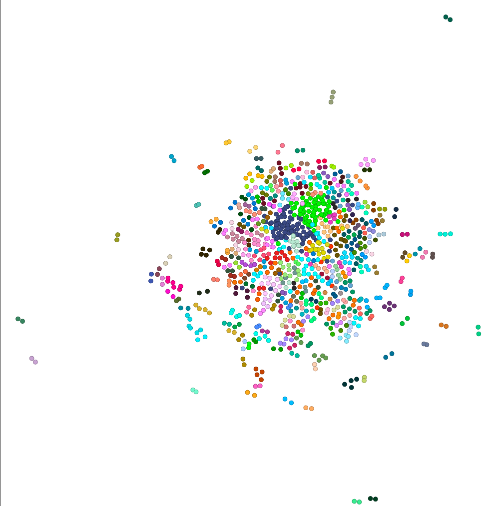
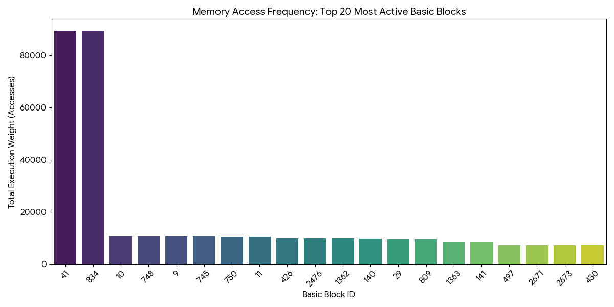
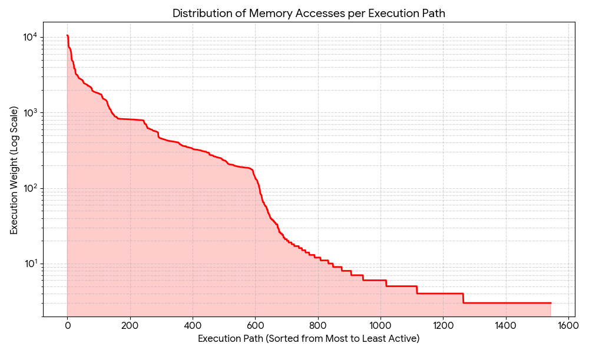

+++
title = "Final Report: Using MemGaze Traces of HPC Workloads for CPU p-state Optimization"
[extra]
latex = true
[[extra.authors]]
name = "Soren Emmons"
[[extra.authors]]
name = "Deptmer Ashley"
[[extra.authors]]
name = "Nolan Cutler"
+++

## Introduction

As the demand for High-Performance Computing (HPC) environments grows, managing their power consumption is critical. As modern computing systems become more powerful, we are finding a growing performance imbalance between rapid CPU execution and slow data movement. During memory access, the CPU pipeline stalls. If the CPU remains at its max voltage and frequency during these stalls, it wastes power without contributing to the overall performance.

In order to take advantage of these stalls, MemPower was created. It is a flexible model-based approach that characterizes the memory behavior of parallel workloads and optimizes their power states. By analyzing memory access traces using the program MemGaze, which utilizes the Intel Processor instruction ptwrite, MemPower identifies specific code regions that cause “hotspots” in the CPU. It then uses a custom cost-benefit model to statistically instrument the application binary, injecting P-state transitions to lower CPU frequency only when the energy saving will outlast the hardware transition latency. 

The goal of this project was to identify real-world workloads to gather memory traces from to benchmark MemPower. We worked with a graduate student, Nanda Velugoti, to research and gather memory traces of an HPC programs: LULESH. By gathering and profiling these applications, we were able to capture data reflecting different memory behaviors, such as the regular, the more strided accesses typical for LULESH. Ultimately, the characterization of these traces provides the foundational data required to validate MemPower’s ability to dynamically reduce energy consumption in production HPC environments.

## Background

### MemGaze:
MemGaze is a low-level memory analysis tool designed to capture memory access traces from an executing application binary. To gather these traces, MemGaze takes advantage of the Intel Processor instruction ptwrite. The tool uses DynInst to instrument the target application at the binary level, injecting a ptwrite instruction after every memory access. During run time, the CPU’s hardware records the trace point and the accessed memory address. Memgaze then processes the raw trace to find memory characteristics. 

### Mempower: 
The traces gathered in this project are meant to benchmark Mempower, a model-based power management framework. The goal of MemPower is to take advantage of CPU stalls during memory access to reduce wasted power consumption during these stalls. MemPower does this by analyzing MemGaze traces, identifying specific latency-bound memory “hotspots”, and running them through a custom cost-benefit model that determines if the energy savings gained outweigh the hardware latency cost. MemPower then triggers P-state transitions to lower the CPU frequency when the cost-benefit model determines that the energy savings outweigh the hardware latency cost. This results in a more optimized system with lower power consumption without sacrificing performance. 

### LULESH:
To benchmark the performance of MemPower, we required an HPC and OPENMP workloads that stress the memory in different ways. We originally chose LULESH, LAMMPS, and QMCPACK, but had technical difficulties with compiling QMCPACK and LAMMPS. 

- LULESH (Livermore Unstructured Explicit Shock Hydrodynamics): Lulesh is a widely used proxy application that simulates the hydrodynamics equations, specifically the Sedov Blast problem. We chose LULESH due to its highly memory-intensive but largely regular and strided access patterns. Because its data structures are predictable, it stresses memory bandwidth while allowing the CPU cache to function relatively efficiently.

## Design and Implementation
### Hardware
Using the Northwestern Server
**CPU:** 2x 8-Core Intel Xeon Silver 4509Y (2.60 GHz)
**RAM:** 503.41 GiB total memory
**OS:** Ubuntu 22.04.5 
**GPU:** Integrated Matrox G200eW3 Graphics

The implementation process consisted of several steps. First, the workload was compiled and executed under MemGaze instrumentation. MemGaze modifies the executable so that memory accesses can be tracked during runtime.

Example execution looked like:

  
   
  Figure 1: Shows cpu heat map of traces Lulesh 2.0.

When the program runs, MemGaze records detailed information about memory accesses, including addresses and access frequencies. After the traces were generated, they were processed and converted into graphs showing memory access frequency, memory utilization over time, and general memory activity patterns. These graphs served as the primary tool for understanding how the workload interacted with the memory subsystem.

### Methodology
We specifically looked for OpenMP workloads as OpenMP forces all the threads to share the same memory space. This creates memory traffic jams and cache stalls that MemPower is designed to optimize. Once we found OpenMP workloads, we used MemGaze to collect all of the memory accesses at the binary level. The raw output from MemGaze is a massive binary, so we needed to translate it. We then used several Python scripts to shift the instruction pointers (IPs) so that the memory addresses matched their original source code, and then mapped those corrected addresses to their block IDs, which indicate which functions the CPU was executing. Then, by generating a weighted edge list and applying a Directed Louvain algorithm, we mapped execution traffic and isolated the distinct phases of the workload. This weighted edge list then allowed us to graph the block IDs so we could visualize their specific functions' CPU usage.

## Results

### LULESH: 
The memory trace gathered from LULESH resulted in a highly interconnected trace. By translating the raw memory into a directed graph and applying the Louvain modularity algorithm, we are able to visualize the workload behavior and identify “hotspots” as seen in figures X and X. The heatmap shows centralized hotspots of basic blocks. These clusters represent the computational loops of the simulation where the CPU is calculating complex spatial coordinates and thermodynamic variables. In contrast to the “hotspots” identified when graphing the data, we also see “cold” regions, which are the memory-bound phases of the simulation. These cold and hot regions are important to optimizing with MemPower, as the cold regions are where the CPU is stalled, meaning the CPU is waiting for data to travel back from memory to the cache. The “hot” regions that MemGaze identified are where the workload is compute-bound, and the CPU is being heavily used. These “cold” regions are where MemPower will want to prioritize power saving, while the “hot” regions are where MemPower will want to prioritize speed. 

Through quantitative analysis of the MemGaze trace, we see that the profiler captured 1,545 unique execution paths accounting for a total of 617,962 memory accesses. When sorting for execution paths by traffic weight, we observed that there was an 80/20 split in memory utilization. We found that the top 20% (the “hot” regions)  of active execution paths accounted for 84.76% (523,800) of all memory accesses. While the remaining 80% (the “cold” regions) of execution paths accounted for 15.24% of memory traffic.

This was gathered using these formulas in a Python script:

To find the most active region, we sort the paths by weight

\[ w(p_1) > w(p_2) > ... > w(p_n) \]

To define our hot phase, we find the top 20% of active paths where k is the number of paths in the top percentile, k = 0.20 * N:

\[W_{hot} = \sum_{i=1}^{k} w(p_i) \]

 We can then express this is a percentage of total memory constrained within the hot phase: 

\[ \text{Hot Phase Traffic} = (\frac{W_{hot}}{W_{total}}) * 100 \]

 We can calculate the cold phase by finding the remaining paths 

\[ W_{cold} = W_{total} - W_{hot} \]

 Then, the percentage of memory traffic in the cold is calculated 

\[ \text{Cold Phase Traffic} = (\frac{W_{cold}}{W_{total}}) * 100 \]

This data shows that for 80% of these execution paths represent the setup, teardown, and transitional period where the CPU is primarily idle waiting for data to load from memory. This split of “cold” and “hot” regions represents the compute-heavy inner loop and memory-bound outer branches. This validates the premise of MemPower because 80% of the execution paths are “cold”, which represent bottlenecks in memory retrieval rather than processor speed. Maintaining the CPU at its maximum p-state during these “cold” regions is a waste of power consumption. Based on this data, LULESH would be a perfect candidate for MemPower due to the wasted power consumption we see while in the “cold” regions, as MemPower can take advantage of this region and lower the p-state, which would, in theory, greatly reduce the power consumption of running this simulation.

  
   
  Figure 2: Shows the most frequently accessed blocks

  
   
  Figure 3: Execution paths sorted from the most active to the least active using log scale

## Challenges 
#### What Were the Hardest Parts to Get Right?
The most difficult parts of conducting this research project were finding the right machine, setting up the tooling, and [insert one more here]. Since the **ptwrite** instruction is quite specific, finding hardware with what we needed took some time. After getting the setting figured out, downloading, compiling, and running the workloads was half of the battle. These workloads are not simply plug and play tools, they require many dependencies, compilation arguments and must operate with OpenMP. After getting over these hurdles, taking traces became streamlined, and creating graphs followed soon afer.

#### What Was Surprising?
**Deptmer:** "I think what was most surprising was how long it took just to get everything setup. I was so worried about the data and what it would mean that I never considered what tools we needs and how careful, and particular you need to be about them."

**Soren:** "My biggest surprise was the learning curve on using all of the tools that were required to gather the traces. I had not used a nix-shell before and was not familiar with all of the programs we used, so it took me some time to be able to navigate through our project."

**Nolan:** "I was surprised at the difficulty of finding the right hardware for our experimental setup. PTWRITE is a relatively new instruction, and getting access to a server that was both powerful enough to run LULESH and had the instruction was tricky. We were fortunate to have been given access to a private server managed by Northwestern, but had that not been the case, it would have been much more difficult to get setup."

#### Were You Successful?
Ultimately the research was a success. Albeit there were some large hiccups, we got to see what we were looking for. There is always time to gather more information and compare against other workloads but getting one and seeing what it means to do research in computer science is plenty in a couple of months. 

## Conclusion

This project explored how analyzing memory behavior can help identify opportunities for improving power efficiency in HPC workloads. By instrumenting LULESH with MemGaze, it was possible to collect detailed memory traces and visualize how these programs interact with the memory subsystem. The resulting analysis suggests that memory access patterns play a significant role in workload performance. Understanding these patterns is important for designing systems that balance performance and energy efficiency. If workloads spend a large portion of time waiting on memory accesses, lowering CPU frequency may reduce power usage without significantly impacting runtime. Future work could expand this analysis by directly measuring energy consumption under different CPU P-states and evaluating a larger set of HPC workloads.

[Presentation Slides](https://docs.google.com/presentation/d/19AodcMlRuCYOZu_ZAdwgUyVt_uhqtWqNLmOspCjGDqo/edit?usp=sharing)
