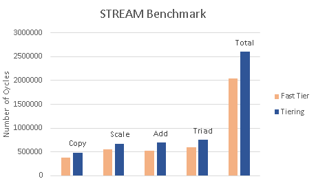

+++
title = "Hardware-Based CPU-Transparent Memory-Tiering Controller Implemented on FPGA"
[extra]
bio = """ """
[[extra.authors]]
name = "Thomas Pinon (Platform Achitechture)"
[[extra.authors]]
name = "Donovan Burk (Controller Design)"
[[extra.authors]]
name = "Eric Morgan-Bronec (Benchmarking)"
+++

# Project Goal
Our goal was to create a hardware implementation of a memory-tiering controller in synthesizable RTL. We wanted this tiering controller to exist between the CPU and the physical memory and be transparent to the CPU itself. The idea was to have both a region of fast ("near") memory and a region of slow ("far") memory behind the controller. The CPU would have access to a single contiguous address space containing both regions of memory, but it would not have any concept of where any individual address lived. Because of this, the CPU would not have to make any intelligent decisions about where it allocates its memory in terms of trying to make the best use of the faster memory region. This logic is offloaded to the controller. The controller would keep track of memory accesses, and categorize chunks of the physical address map as "hot" or "cold", depending on how recently the CPU touched them. The controller would perform two tasks based on this information. First, it would perform basic address virtualization. It would keep a lookup table of the virtual addresses the CPU sees (although the CPU still thinks these are physical addresses), and map these to actual physical addresses across the two tiers. When the faster tier becomes full and a new access is made by the CPU, the "coldest" (oldest) chunk currently in the faster tier should be migrated to the slower tier and its address table entry should be updated to reflect that. This strategy should allow a system to intelligently take advantage of multiple memory tiers with different latency characteristics without even knowing that these tiers exist.

# Design
## Evaluation Platform
The first step of implementation was to design a system on which to test our controller. We wanted to use an FPGA, since it seemed like the most reasonable real-world approach for our timeline. We ended up using an Artix-7. At the most basic level, we needed a CPU that could run a synthetic workload to generate memory traffic and a memory system containing multiple tiers with different latency characteristics. For the CPU, we decided to use a bare-metal configuration of a Xilinx/AMD MicroBlaze. This is a soft-core processor that can be instantiated in the FPGA fabric. Importantly, these cores can be configured with an AXI4 peripheral bus. This is a standard on-chip memory interconnect protocol, and it's what we decided to base our memory system off of. Now that we had our CPU to generate memory traffic, we needed our two memory tiers. We had first thought about using DRAM, since it would be more realistic, but quickly realized BRAM would make more sense. The "realistic" aspects of DRAM would add nothing to our evaluation of our controller, and might even make our latency data less reliable. BRAM was much easier to implement and has very deterministic base latency, making it ideal for use in a strictly-controlled test.

We instantiated two AXI4 BRAMs, each 64KB. These served as our two memory tiers, but we needed a way to make one slower. To accomplish this, we built a custom AXI4 latency injector module to sit in from of the slow-tier BRAM. Essentially, it just delayed AXI4 transactions going through itself by holding the valid signals low for a configurable period of time. We set this latency to 50 cycles for our tests. At this point, we had a CPU and two tiers of memory with different access latencies. We needed a few more peripherals, an AXI4 timer and an AXI4 UART. We used off-the-shelf Xilinx/AMD IP for these. The timer was necessary because we needed a way to count cycles from inside our workload program. Without this, we would not have been able to compare the latencies of different memory accesses. The UART was necessary so that our workload program could communicate results to the outside world.

## Memory Controller
The choice of using the Vivado IP catalog as the main building blocks of the design simplified the design phase of the controller system because the interactions with the rest of the system was constrained to using AXI protocols. This meant that times when the signal simply needed to pass thorugh the controller it could do just that. But the rest of the time, the controller expected an AXI signal which was well defined. Since we had split up the system into far and near memory and wanted to use most of the memory space as actual memory space, we had to move data around between tiers via swapping data between tiers. This mean that we needed to move the data around at a fast pace to not hinder further memory accesses. For this we used the Vivado AXI Datamover IP, which allowed us to transfer our entire chunks of memory with single command signals that we defined to be 256 Bytes. Since we wanted to use the data mover for all of the data transfers, we opted to sacrifice one block of far memory for a scratch. The process of swapping memory would go: copy near memory block to scotch, copy far block to near block, copy scratch to far block. There could probably be a more efficient way to achieve this, but this made the tier controller design simpler. 

For the actual memory controller, we made a custom design instead of just using IP blocks. The memory tracking looks like a fully associative cache, but instead all memory locations are tracked. In face of the complexity of the rest of the system, we opted for a simpler replacement algorithm. We used something akin to a FIFO algorithm, where replacement was based on swapping memory with what had been in close memory the longest. The system starts with assuming that both memory sections have real data in them, and that all of the low half of memory is in the close tier. This leads to lows accesses passing through and high accesses causing swapping on startup. As the system continues to run, depending on the task running, the close tier will start to mix low and high addresses. 

# Benchmarking and Results.
## Benchmark
We evaluated our Tiering Controller using a workload based on the STREAM benchmark. STREAM is used to test memory bandwidth and computation time for simple vector operations. Stream uses three arrays A, B, and C as well four vector operations to measure performance.
- Copy: evey element from B to A.
- Scale: Scales every element in B and stores it in A.
- ADD: Adds B and C together and stores the sum in A.
- Triad: Scales C, adds it to B, then stores the result in A.
It does this for ten iterations and measures the average number of cycles. the total size of the arrays is 64Kb which is enough to overflow into the far Tier of memory.

## Results
We ran this on two platforms. We first ran it on an platoform that only had the fast tier of memory to get a baseline performance of our system. We then ran it on with tiering controller and measured the percentage slowdown. We measured the latency of the slow tier to be about 2.3x slower than the fast tier. This was verified by accesing memory in each section and measuring the latency in clock cycles with an AXI bus timer.

### Latency Compared to Baseline
- Copy: 1.28x
- Scale: 1.22x
- Add: 1.33x
- Triad: 1.26x
- Total: 1.27x

 The results show that the controller sucessfully managed both the near and far tiers of memory and preformed close to the baseline with fast memory. If we were not using Tiering and just had the near and far memory togehter with not Tiering algorithm we should get a slowdown of 1/2 + 2.33/2 = 1.67X. a slowdown of 1.27X shows that our controller is not only allocating memory but placing hot pages in the fast memory and cold pages in the slow memory.

# Challenges
Some of the most significant challenges just involved working with the Xilinx/AMD tools (Vivado and Vitis). They were pretty unintuitive at times. One of the largest struggles in the beginning was getting the first AXI4 IP (the latency injector) properly packaged. Once you have the RTL implementation of your design, you must run it through Vivado's AXI IP packager, which configures interfaces properly so that the block can be integrated into a top-level block design and interact with the other AXI IPs correctly. For a while, we were sure we had the latency injector logic designed correctly, but our tests were consistently showing that both AXI BRAMs were being accessed with the same latency. This meant that our latency injector was being bypassed, but we weren't sure why. It turned out to be a memory mapping issue. In the IP packager, we had misconfigured the memory mapping of the input and output AXI interfaces in a few important ways. Even though the top-level memory map looked correct, the latency injector IP was not properly configured to route the input interface through the logic to the output interface. Another challenge was debugging.
There were couple times where the controller appeared to be working correctly but when running benchmarking code I wouldnt work as expected. One example is we had a bug in the memory write handshake state machine that caused most of our memory to be read-only. we didnt find out about this issue until we tried running benchmarks on it. After that was fixed we encountered an issue with the data mover that prevented us from accessing the far tier of memory.

One of the biggest challenges was implementing a algorithm that makes sense in traditional coding flow, in verilog. Verilog is inherently different structure of a language because it is not describe a flow, it is describing a net of signals. Coding in something like C is simple in that things don’t change unless you update them, but in verilog signals can change because something upstream has updated, so there are time limits on signals and have to save things you want to use later. System Verilog has some nice function tools that make the logic flow part of the design easier, but it still follows the idea that data is temporary unless it isn’t. 

# Suprises
Although learning how AXI worked was difficult for a first time looking at it. Once I understood how it worked, it was easier to replicate signals where they needed to be moved to. I wasn’t expecting working within a new system to go as smoothly as it did. I expected hidden snags to pop up from edge cases I didn’t know about, but that rarely happened. The Tiering controller worked as expected and did not producee any suprising results once it was fully functioning. The Tiering controller was slower than the baseline but not by an unreasonable amount considering how much slower the slow memory was.

# Project Deliverables
https://github.com/MemoryTiering/tmc

## Generative AI disclosure
Google Gemini 3 pro was used in developing the achitechture.
Chat GPT was used in the process of creating parts of the controller as well as debugging Benchmarking code.
